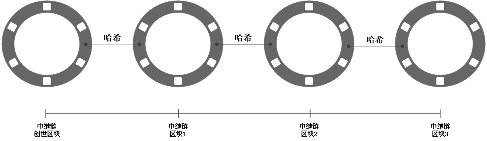

# 
Polkadot概述及其设计方案
  

Jeff Burdges1, Alfonson Cevallos1, Peter Czaban1, Rob Habermeier2
 
Syed Hosseini1, Fabio Lama1, Handan Kılın¸ c Alper1

Ximin Luo1, Fatemeh Shirazi1, Alistair Stewart1, Gavin Wood1,2
  

1Web3 Foundation,
  

2Parity Technologies
  

June 1, 2020
  
  

译者：郭斌(amadeusgb123@gmail.com)

路路(xx@gmail.com)
  

Faye Wang(xx@gmail.com)
  

## 
摘 要
  
&emsp;&emsp;在本文中，我们描述了异构多链协议 Polkadot 的设计组件，并解释了这些组件如何帮助Polkadot解决区块链技术的一些现有缺点。目前，现有的很多不同功能的区块链项目，可能在设计时未考虑相互协作的能力。这导致用户难以在不同的区块链之间使用大量交互的应用程序。此外，随着项目数量的增加，每个项目单独提供的安全性变得越来越弱。Polkadot旨在为多条链提供一个可扩展且可互操作的框架，该框架具有池化安全性，这是通过本文中描述的组件集合实现的。

- [1 简介](https://github.com/AmadeusGB/Overview-of-Polkadot/blob/main/book/Introduction.md)
- [2 概要](https://github.com/AmadeusGB/Overview-of-Polkadot/blob/main/book/Security_model.md)
  - [2.1 安全模型](https://github.com/AmadeusGB/Overview-of-Polkadot/blob/main/book/Security_model.md)
  - [2.2 节点与角色](https://github.com/AmadeusGB/Overview-of-Polkadot/blob/main/book/Nodes_and_roles.md)
  - [2.3 协议](https://github.com/AmadeusGB/Overview-of-Polkadot/blob/main/book/Protocol.md)
- [3 序言](https://github.com/AmadeusGB/Overview-of-Polkadot/blob/main/book/Roles.md)
  - [3.1 角色定义](https://github.com/AmadeusGB/Overview-of-Polkadot/blob/main/book/Roles.md)
  - [3.2 Polkadot对抗模型](https://github.com/AmadeusGB/Overview-of-Polkadot/blob/main/book/Adversarial_Model_of_Polkadot.md)
- [4 组件和子协议](https://github.com/AmadeusGB/Overview-of-Polkadot/blob/main/book/Nominated_proof-of-stake_and_validator_election.md)
  - [4.1 NPoS和验证人选举](https://github.com/AmadeusGB/Overview-of-Polkadot/blob/main/book/Nominated_proof-of-stake_and_validator_election.md)
  - [4.2 中继链状态机](https://github.com/AmadeusGB/Overview-of-Polkadot/blob/main/book/Relay_Chain_State_Machine.md)
  - [4.3 共识](https://github.com/AmadeusGB/Overview-of-Polkadot/blob/main/book/Blind_Assignment_for_Blockchain_Extension.md)
    - [4.3.1 BABE](https://github.com/AmadeusGB/Overview-of-Polkadot/blob/main/book/Blind_Assignment_for_Blockchain_Extension.md)
    - [4.3.2 GRANDPA](https://github.com/AmadeusGB/Overview-of-Polkadot/blob/main/book/GRANDPA.md)
  - [4.4 平行链](https://github.com/AmadeusGB/Overview-of-Polkadot/blob/main/book/Block_Production.md)
    - [4.4.1 区块生成](https://github.com/AmadeusGB/Overview-of-Polkadot/blob/main/book/Block_Production.md)
    - [4.4.2 有效性和可得性](https://github.com/AmadeusGB/Overview-of-Polkadot/blob/main/book/Validity_and_Availability.md)
    - [4.4.3 跨链消息传递（XCMP）](https://github.com/AmadeusGB/Overview-of-Polkadot/blob/main/book/Cross-chain_Message_Passing.md)
  - [4.5 经济激励层](https://github.com/AmadeusGB/Overview-of-Polkadot/blob/main/book/Staking_rewards_and_inflation.md)
    - [4.5.1 质押奖励和通胀设计](https://github.com/AmadeusGB/Overview-of-Polkadot/blob/main/book/Staking_rewards_and_inflation.md)
    - [4.5.2 中继区块限制和交易费设计](https://github.com/AmadeusGB/Overview-of-Polkadot/blob/main/book/Relay-chain_block_limits_and_transaction_fees.md)
  - [4.6 治理](https://github.com/AmadeusGB/Overview-of-Polkadot/blob/main/book/Proposals_and_Referenda.md)
    - [4.6.1 提案和公投](https://github.com/AmadeusGB/Overview-of-Polkadot/blob/main/book/Proposals_and_Referenda.md)
    - [4.6.2 理事会和技术委员会](https://github.com/AmadeusGB/Overview-of-Polkadot/blob/main/book/The_Council_and_the_Technical_Committee.md)
    - [4.6.3 平行链卡槽配置](https://github.com/AmadeusGB/Overview-of-Polkadot/blob/main/book/Allocation_of_parachain_slots.md)
    - [4.6.4 国库](https://github.com/AmadeusGB/Overview-of-Polkadot/blob/main/book/Treasury.md)
  - [4.7 密码学](https://github.com/AmadeusGB/Overview-of-Polkadot/blob/main/book/Account_keys.md)
    - [4.7.1 账户密钥](https://github.com/AmadeusGB/Overview-of-Polkadot/blob/main/book/Account_keys.md)
    - [4.7.2 会话密钥](https://github.com/AmadeusGB/Overview-of-Polkadot/blob/main/book/Session_keys.md)
  - [4.8 网络](https://github.com/AmadeusGB/Overview-of-Polkadot/blob/main/book/Networking_overview.md)
    - [4.8.1 网络概况](https://github.com/AmadeusGB/Overview-of-Polkadot/blob/main/book/Networking_overview.md)
    - [4.8.2 Gossiping](https://github.com/AmadeusGB/Overview-of-Polkadot/blob/main/book/Gossiping.md)
    - [4.8.3 分发服务](https://github.com/AmadeusGB/Overview-of-Polkadot/blob/main/book/Distributed_service.md)
    - [4.8.4 存储和可用性](https://github.com/AmadeusGB/Overview-of-Polkadot/blob/main/book/Storage_and_availability.md)
    - [4.8.5 跨链消息](https://github.com/AmadeusGB/Overview-of-Polkadot/blob/main/book/Cross-chain_message.md)
    - [4.8.6 哨兵节点](https://github.com/AmadeusGB/Overview-of-Polkadot/blob/main/book/Sentry_nodes.md)
    - [4.8.7 授权、传输和发现](https://github.com/AmadeusGB/Overview-of-Polkadot/blob/main/book/Authentication_transport_and_discovery.md)
- [5 远期计划](https://github.com/AmadeusGB/Overview-of-Polkadot/blob/main/book/Future_Work.md)
- [附录A](https://github.com/AmadeusGB/Overview-of-Polkadot/blob/main/book/SPREE.md)
  - [A.1 SPREE](https://github.com/AmadeusGB/Overview-of-Polkadot/blob/main/book/SPREE.md)
  - [A.2 与外链的互操作性](https://github.com/AmadeusGB/Overview-of-Polkadot/blob/main/book/Interoperability_with_External_Chains.md)
  - [A.3 与其他多链系统的对比](https://github.com/AmadeusGB/Overview-of-Polkadot/blob/main/book/ETH2.0.md)
    - [A.3.1 ETH2.0](https://github.com/AmadeusGB/Overview-of-Polkadot/blob/main/book/ETH2.0.md)
    - [A.3.2 Sidechains](https://github.com/AmadeusGB/Overview-of-Polkadot/blob/main/book/Sidechains.md)
    - [A.3.3 Cosmos](https://github.com/AmadeusGB/Overview-of-Polkadot/blob/main/book/Cosmos.md)
- [词汇表B](https://github.com/AmadeusGB/Overview-of-Polkadot/blob/main/book/Glossary.md)

# 1.简介
&emsp;&emsp;Internet 最初是为 TCP/IP 等去中心化协议设计和构建的，但是，它的商业化导致了当今所有流行的Web应用程序的中心化。我们指的不是物理基础设施的任何中心化，而是指逻辑中心化对基础设施的权力和控制。两个突出的例子是像谷歌和 Facebook 这样的大公司：虽然它们以物理上分散的方式在世界各地维护服务器，但这些最终都由一个实体控制。
控制系统的中央实体会给每个人带来许多风险。例如，他们可以随时停止服务，可以将用户的数据出售给第三方，并在未经用户同意的情况下操纵服务的运作方式。这对于严重依赖这些服务用于商业或私人目的的用户尤其重要。

&emsp;&emsp;随着个人数据所有权意识的觉醒，网络用户对更好的安全性、自由度和控制的需求日益增长。因此，对于没有单一实体控制系统的更分散的应用程序而言，这是一种反向运动。这种权力下放的趋势并不新鲜。它已被用于网络和其他系统开发的许多领域，例如自由软件运动。

&emsp;&emsp;区块链是为解决这些问题而提出的一项技术，旨在建立一个去中心化的网络。然而，它只有在大众可用的情况下才能与集中式网络竞争的最终用户。其中一个重要方面是，单独的应用程序必须能够交互，否则每个应用程序都会变得孤立，不会被尽可能多的用户采用。必须建立这样一个互操作性机制引入了新的挑战，由于两种范式之间信任模型的根本差异，集中式模型中缺少许多挑战。例如，比特币[26]和以太坊[10]是工作量证明 (PoW) 区块链，其中安全性依赖于对处理能力的假设；而股权权益证明 (PoS) 系统的安全性依赖于激励措施和销毁保证金的能力。这些差异给区块链之间的互信带来困难。区块链技术需要解决的另一个挑战是可扩展性。现有的区块链系统普遍存在高延迟，每秒只能进行数十笔交易[14]，而万事达卡或维萨卡等信用卡公司则执行每秒数千笔交易[3]。

&emsp;&emsp;区块链可扩展性的一个突出解决方案是并行运行许多链，通常称为分片。 Polkadot 是一个多链系统，旨在将所有这些链的安全力量集中在一个共享的安全系统中。它于2016年由Gavin Wood[33]首次引入，在本文中我们将详细介绍。 

&emsp;&emsp;简而言之：Polkadot利用称为中继链的中央链与称为平行链（平行链的组合）的多个异构和独立分片链进行通信。中继链负责为所有平行链提供共享安全，以及平行链之间的可信跨链交易。换句话说，Polkadot旨在解决如上讨论的内容：互操作性、可扩展性以及因算力分流所削弱的安全性问题。 

**论文组织**：在下一节中，我们将概述 Polkadot 网络，包括其与客户端平行链的外部接口，我们将在后续部分中对其进行扩展。我们回顾初步信息，例如第3 节中对 Polkadot 参与者角色和我们的对手模型的描述。我们在第4节中解释了 Polkadot的子协议和组件试图实现的目标，然后继续详细阐述它们，包括底层加密和网络原语。最后，我们将在第5节中简要讨论一些未来的工作。在附录中，我们回顾了相关工作，例如与其他多链系统A.3的比较、桥接到外部链 A.2的互操作性方案的简短描述、用于消息传递的安全执行方案A.1，以及包含Polkadot特定术语的词汇表1。
# 2.概要
&emsp;&emsp;本节目的是描述Polkadot的主要功能，而不会详细介绍设计方案和推论。  

&emsp;&emsp;Polkadot系统由一个称为中继链的开放协作去中心化网络构成，该网络与许多其他并行运行的外部链交互，称为平行链。从上层的角度来看，平行链是中继链的客户端，中继链为这些客户端提供安全服务，包括安全通信。这是中继链的唯一目的；平行链是提供应用程序级功能的载体，例如加密货币。  

&emsp;&emsp;平行链的内部细节不是中继链关心的问题；平行链只需要在我们指定的接口上显示。其中一些期望是基于区块链的基础组成部分，因而得名。但是，其他非区块链系统也可以作为Polkadot平行链运行，只要它们满足该接口即可。如下所述：相关部分加下划线。  

&emsp;&emsp;这些方面可以简称为，Polkadot是一个可扩展的异构多链协议。
## 2.1 安全模型
&emsp;&emsp;我们假设平行链作为中继链的外部不可信客户端运行，并且中继链仅通过接口处理平行链，而不对其内部进行假设。例如，在内部它们可能为许可或开放网络；如果一些内部用户破坏了平行链内部结构，从Polkadot的角度来看，该平行链（作为单个客户端载体）都是恶意的。  

&emsp;&emsp;作为开放的去中心化网络，Polkadot中继链需要内部处理某种程度的恶意行为。特定的单个节点是不可信的，但大小下限的不可确定的节点子集是可信的，该协议的作用是确保外部的中继链作为一个整体是可信的。有关详细信息，请参阅第3.2节。
## 2.2 节点和角色
&emsp;&emsp;Polkadot中继链网络由节点和角色组成。节点是物理执行 Polkadot 软件的网络级实体，角色（第3.1节）是执行特定目的的协议级实体。节点可以扮演多种角色。  

&emsp;&emsp;在网络层面，中继链是开放的。任何节点都可以运行软件并作为以下任何类型的节点参与：  

&emsp;&emsp;1. 轻客户端 - 从网络中检索某些与用户相关的数据。轻客户端的可用性无关紧要 - 它们不会对其他节点/客户端提供服务。  

&emsp;&emsp;2. 全节点 - 检索所有类型的数据，长期存储，并与其他全节点同步通信。因而必须是高可用的。  

&emsp;&emsp;&emsp;(a) 哨兵节点 - 公共可访问的完整节点，为私有完整节点执行受信任的		代理服务，由同一运营商运行。  

&emsp;&emsp;&emsp;有时我们指的是平行链的完整节点。对于由非区块链所构成的平行链来说，这意味着他们参与到足够的程度，以至于他们可以验证通过它的所有数据。  

&emsp;&emsp;除了分发数据之外，中继链节点还可以执行下面列出的某些协议级别的角色。其中一些角色具有与之相关的限制和条件：  

&emsp;&emsp;1. 验证人  - 执行大部分安全工作。必须是中继链的全节点。与平行链收集人交互，但不需要作为完成节点参与平行链出块工作。  

&emsp;&emsp;2. 提名人 - 支持和选择验证人列表的利益相关者（第4.1节）。可以由轻客户端完成，它们不需要对平行链有任何了解。
 
&emsp;&emsp;平行链可以决定自己的内部网络结构，但预期通过如下角色与Polkadot交互：  

&emsp;&emsp;1. 收集人 - 收集平行链数据并将其提交给中继链，遵守以下描述的协议规则。它们是由平行链定义选择的，并且必须是完整节点。  

&emsp;&emsp;2. 钓鱼人 - 代表提供奖励的中继链对平行链的正确操作进行额外的安全检查。这个角色是自我分配和奖励激励的，并且必须是平行链的完整节点。  
## 2.3协议
波卡中继链协议，包括与平行链间的交互，其工作原理如下。  

**1.对于平行链**:  

&emsp;&emsp;(a) 收集人会实时跟踪中继链区块的生成过程和共识协议，分别执行下面的步骤(2)和(5)。例如，作为全节点参与到中继链当中，基于此来确定最有可能成为最新中继链的区块。另一方面，最新平行链区块（或其他数据）也将由这一最新中继区块所确定。  

&emsp;&emsp;(b) 收集人对上述最新平行链区块上构建的数据完成签名后，将信息以间接形式递交到其平行链委派的验证人(平行链验证人简称验证人)，通过此步骤将信息输送到中继链。理想情况下，为提高执行性能，收集人仅递交唯一的方案。  

&emsp;&emsp;(c) 由平行链验证人决定支持哪一个平行链区块，并公布该区块的相关数据，以表明其将作为该平行链的候选人被添加至下一个中继区块当中。  

2.中继链上负责区块生成的验证人会从所有平行链上收集候选区块，并把这些候选区块和最新的中继链外部调用一起放入中继链最新生成的区块中 (第4.3.1节) 。考虑到执行性能，这一过程产生的数据不包含平行链的完整数据，仅包含元数据和部分数据，当然安全相关的元数据包含在内。
在不利的情况下，这可能导致分叉，步骤(5)中会给出详细说明。该子协议被设计成即使有分叉，参与者也能知道最有可能成为最终块的区块，类似于工作量证明协议。  

3.子协议的运行以确保完整数据确实可用、涵盖并分发到其他各种中继链节点。（第4.4.2节）  

4.平行链递交数据时可能包含相关其向另一条平行链发送信息的相关信号指示，包括促进该过程的元数据。现在这些数据将包含在中继链链头部分，所以作为接收方的平行链可以得到新信息输入的相关信号。相比当前，接收方需要通过检索发送方的信息正文才能获取相关信息。（第4.4.3节）  

5.验证人提交他们对区块的投票并最终确定，解决了因意见不同而产生分叉的问题（第4.3.2节）。上述投票将会被添加到中继区块中。  

本文接下来的内容将对上述内容进行阐述-第3节对角色设计进行详述，第4 节对协议子组件进行详解。
# 3 序言
在本节中，我们将更详细地介绍参与波卡运行的不同角色，包括我们为这些角色而创建的安全模型。对于这些角色的理解，有利于进一步理解整个协议的设计，包括协议是如何工作的，以及采用这种设计的原因。
## 3.1 角色定义
波卡网络节点的运行是基于接下来我们要介绍的相关角色和功能设定而展开的。 
 
&emsp;&emsp;**验证人**：验证人在波卡网络拥有最高权限，控制并承担新区块的打包工作。验证人需要质押足够多的资金，但是由于我们允许其他有资金的提名人推举一个或多个可以代表他们的验证人，所以验证人的部分资金可能并不是自有资金，而是来自提名人。各验证人运行中继链的客户端，必须具备高可用性和高带宽的性能条件，节点必须准备好在每一个中继区块上批准某一平行链的新区块，有时候可能是几个新区块的确认。这个过程包括接受、验证、再发布候选区块。平行链的任务分配给验证人存在随机性，且变化频繁，要求验证人维护所有平行链的数据并保证数据库的完全同步，显然是不合理的，于是，“收集人”概念应运而生，作为第三方平行链的新区块。指定验证人集合一旦合理地批准所属平行链的所有新区块，验证人本身必须进行中继链的区块批准工作。过程包括更新交易队列的状态（将数据从一条平行链的输出队列传输到另一条平行链的输入队列），处理已批准的中继链的交易批次以及对最终区块进行审批。如果查证到验证人没有达到职责要求，将会被重罚。例如，质押在他们名下的所有资金或者部分资金被没收。某种意义上，验证人角色和基于POW区块链的矿池有类似之处。  
 
&emsp;&emsp;**提名人**：提名人作为利益相关方，为每一个验证人贡献安全性资金。提名人主要作用就是将风险资本质押到他们信任的一个或一组验证人，以代表他们行使维护网络的职责，除此之外，无其他角色职责安排。根据其资金贡献量，提名人会得到其资金占验证人总质押金额里相应比例的奖励或惩罚。和收集人一样，某种意义上，提名人和基于POW网络的矿工相类似。  
 
&emsp;&emsp;**收集人**：交易收集人（简称收集人）作为帮助验证人生产有效平行链区块的一方，会运行某个特定平行链的全节点，也就是说收集人需要保留所有授权新区块所必需的信息，用于打包新块并执行交易，就跟基于PoW区块链的矿工一样。在正常情况下，收集人收集并执行交易，并创建一个“未封装”的区块，连同有效性证明信息将区块递交给一个或多个当前负责审查该平行链区块的验证人。  
 
&emsp;&emsp;**钓鱼人**：不像其他的两个参与方，钓鱼人并不直接参与区块打包的过程。他们是独立的"赏金猎人"，激励他们的是一次性的大额奖励。严格来说，我们希望通过“钓鱼人”的设置，减少恶意行为的发生。即使发生类似情况，希望也只是因为资金质押方私钥不小心泄露，而不是出于蓄意的恶意企图。该名字缘由是考虑到其期望奖励的频率，选择参与的最小要求以及最终能够获得奖励的数量。钓鱼人的奖励来自于能够及时发现资金质押方的非法行为，这对于检测无效平行链区块的批准是非常有价值的。钓鱼人通过及时证明至少有一方（收集人或验证人）存在作弊行为而获得奖励，这对监控无效平行链区块生成与批准很有价值。  

&emsp;&emsp;钓鱼人有点类似于区块链系统中的全节点，所需的资源相对较少，并且不需要承诺稳定的正常运行时间和带宽。他们的不同之处在于钓鱼人必须绑定一小笔保证金。这部分绑定的保证金可以防止因女巫攻击而浪费验证人的时间和计算资源。虽然钓鱼人是波卡安全模型的一部分，但由于并没有为钓鱼人设计激励模型，所以对Polakdot的设计需要保证在没有他们的情况下系统也很安全。我们未来工作的一部分既是为钓鱼人增加一个激励模式。  

&emsp;&emsp;如图1，图例展示了Polkadot协议中定义的结构元素和不同的角色：拥有6条平行链、18个验证人以及每条平行链拥有5个收集人。图2显示了包含5个中继区块的中继链。需要注意的是，分配给一条平行链的验证人数量，是通过验证人总数除以平行链的数量来决定的，但收集人的数量是独立于平行链数量的。桥是允许外部链与Polkadot互操作的子协议，更多信息请参见A.2。

  

图1：一个保护六个平行链区块的的中继块。每个平行链有5个收集人和3个验证人
  
## 3.2 Polkadot对抗模型
&emsp;&emsp;**角色**：通常我们假设诚实的一方会遵循协议算法，而恶意的一方可能采用任意的算法。我们假设四分之三的提名人质押行为属于诚实的一方。基于这一假设，被提名人选出的验证人有三分之二以上是诚实的。我们对恶意钓鱼人的数量没有设定任何限制，因为他们的恶意行为可以被发现并受到惩罚。  

&emsp;&emsp;**平行链**：我们对平行链的区块生成机制没有任何安全假设。另一方面，我们假设大量的收集人是诚实的。Polkadot的安全性并不取决于任何特定的诚实收集人，但它需要存在一些诚实的收集人。  

&emsp;&emsp;部分协议假设每条平行链至少有一个诚实成员；如果这个不可行或不现实，我们就不遵循这一假设，而是对完全恶意的成员进行额外检查。  

&emsp;&emsp;**密钥**：我们假设恶意方通过任意算法生成密钥，而诚实方总是安全地生成密钥。  

&emsp;&emsp;**网络和通信**：所有验证人都有他们自己的本地时钟，且不依赖于任何中央时钟。我们假设验证人和收集人处于部分同步的网络中，意味着，在一个未知参数之下，在大多数时间单位∆（一个未知参数）之后，验证人或收集人发送的消息将会到达网络中的所有各方。所以我们假设信息的最终传递是在Polkadot上。我们还假设收集人和钓鱼人可以连接到中继链网络中来提交他们的报告。  

图2：拥有五个中继区块的中继链。其中每个中继区块包含来自六条平行链的区块，但每个中继区块包含的平行链区块数量可能是不一样的
  
