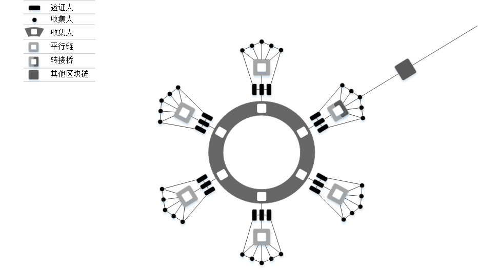

# 
Polkadot概述及其设计方案
  

Jeff Burdges1, Alfonson Cevallos1, Peter Czaban1, Rob Habermeier2
 
Syed Hosseini1, Fabio Lama1, Handan Kılın¸ c Alper1

Ximin Luo1, Fatemeh Shirazi1, Alistair Stewart1, Gavin Wood1,2
  

1Web3 Foundation,
  

2Parity Technologies
  

June 1, 2020
  
  

译者：郭斌(波卡高级大使，amadeusgb123@gmail.com)

路路(波卡高级大使，xx@gmail.com)
  

Faye Wang(波卡初级大使，xx@gmail.com)
  

## 
译者序
  
&emsp;&emsp;本文是波卡技术论文，包括核心技术设计：混合共识GRANDPA/BABE、中继链状态机、经济模型、治理模式、XCMP/SPREE等内容。本文对于全面深入理解Polkadot具有较大的价值，适合具有一定区块链基础的读者阅读。针对波卡技术的设计思路，可进一步参考[Polkadot Wiki](https://wiki.polkadot.network/docs/learn-launch)；如果想要更深入了解设计背后的代码逻辑，可参考[Polkadot github](https://github.com/paritytech/polkadot/)进一步研究。  
&emsp;&emsp;本文第1章、第2.1节、第4.3.2-4.6.2节由郭斌翻译；第2.2-2.3节、第4.6.3-4.8.7节、第5章、附录A.3、词汇表B由王飞凤翻译；第3章、第4.1-4.3.1节、附录A.1-A.2由冯路翻译；郭斌负责全文统稿及图片重制。  
&emsp;&emsp;最后，感谢Web3 基金会、Parity亚洲团队的支持，特别感谢Jimmy Chu对具体翻译工作：专业名词解释、专业内容表达的建议和支持，感谢Helena、Qinwen Wang对本文翻译工作筹建的建议和支持。  

## 
Translator's Preface
 
&emsp;&emsp;This paper is a technical paper on Polkadot, including the core technical design: hybrid consensus GRANDPA/BABE, relay chain state machine, economic model, governance model, XCMP/SPREE, etc. This paper is of great value for a comprehensive and in-depth understanding of Polkadot, and is suitable for readers with certain blockchain foundation. For the design ideas of Polkadot technology, you can further refer to [Polkadot Wiki](https://wiki.polkadot.network/docs/learn-launch); if you want to understand the code logic behind the design more deeply, you can refer to [Polkadot github](https://github.com/paritytech/polkadot/) for further research.  
&emsp;&emsp;Chapter 1, Section 2.1, and Section 4.3.2-4.6.2 are translated by Bin Guo; Sections 2.2-2.3, 4.6.3-4.8.7, Chapter 5, Appendix A.3, and Glossary B are translated by Feifeng Wang; Chapter 3, Sections 4.1-4.3.1, and Appendix A.1-A.2 are translated by Lu Feng; Bin Guo is responsible for the full-text unification and image reproduction.  
&emsp;&emsp;Finally, we would like to thank Web3 Foundation and Parity Asia team for their support, especially Jimmy Chu for his suggestions and support on specific translation work: explanation of professional terms and expression of professional contents, and Helena and Qinwen Wang for their suggestions and support on the preparation of translation work of this paper.  

## 
摘 要
  
&emsp;&emsp;在本文中，我们描述了异构多链协议Polkadot的设计组件，并解释了这些组件如何帮助Polkadot解决区块链技术的一些现有缺点。目前，现有的很多不同功能的区块链项目，可能在设计时未考虑相互协作的能力。这导致用户难以在不同的区块链之间使用大量交互的应用程序。此外，随着项目数量的增加，每个项目单独提供的安全性变得越来越弱。Polkadot旨在为多条链提供一个可扩展且可互操作的框架，该框架具有池化安全性，这是通过本文中描述的组件集合实现的。

## 
Abstract
  
&emsp;&emsp;In this paper we describe the design components of the heterogenous multi-chain protocol Polkadot and explain how these components help Polkadot address some of the existing shortcomings of blockchain technologies. At present, a vast number of blockchain projects have been introduced and employed with various features that are not necessarily designed to work with each other. This makes it difficult for users to utilise a large number of applications on different blockchain projects. Moreover, with the increase in number of projects the security that each one is providing individually becomes weaker. Polkadot aims to provide a scalable and interoperable framework for multiple chains with pooled security that is achieved by thecollection of components described in this paper.  

## 
目录

- [1 简介](https://github.com/AmadeusGB/Overview-of-Polkadot/blob/main/book/Introduction.md)
- [2 概要](https://github.com/AmadeusGB/Overview-of-Polkadot/blob/main/book/Security_model.md)
  - [2.1 安全模型](https://github.com/AmadeusGB/Overview-of-Polkadot/blob/main/book/Security_model.md)
  - [2.2 节点与角色](https://github.com/AmadeusGB/Overview-of-Polkadot/blob/main/book/Nodes_and_roles.md)
  - [2.3 协议](https://github.com/AmadeusGB/Overview-of-Polkadot/blob/main/book/Protocol.md)
- [3 序言](https://github.com/AmadeusGB/Overview-of-Polkadot/blob/main/book/Roles.md)
  - [3.1 角色定义](https://github.com/AmadeusGB/Overview-of-Polkadot/blob/main/book/Roles.md)
  - [3.2 Polkadot对抗模型](https://github.com/AmadeusGB/Overview-of-Polkadot/blob/main/book/Adversarial_Model_of_Polkadot.md)
- [4 组件和子协议](https://github.com/AmadeusGB/Overview-of-Polkadot/blob/main/book/Nominated_proof-of-stake_and_validator_election.md)
  - [4.1 NPoS和验证人选举](https://github.com/AmadeusGB/Overview-of-Polkadot/blob/main/book/Nominated_proof-of-stake_and_validator_election.md)
  - [4.2 中继链状态机](https://github.com/AmadeusGB/Overview-of-Polkadot/blob/main/book/Relay_Chain_State_Machine.md)
  - [4.3 共识](https://github.com/AmadeusGB/Overview-of-Polkadot/blob/main/book/Blind_Assignment_for_Blockchain_Extension.md)
    - [4.3.1 BABE](https://github.com/AmadeusGB/Overview-of-Polkadot/blob/main/book/Blind_Assignment_for_Blockchain_Extension.md)
    - [4.3.2 GRANDPA](https://github.com/AmadeusGB/Overview-of-Polkadot/blob/main/book/GRANDPA.md)
  - [4.4 平行链](https://github.com/AmadeusGB/Overview-of-Polkadot/blob/main/book/Block_Production.md)
    - [4.4.1 区块生成](https://github.com/AmadeusGB/Overview-of-Polkadot/blob/main/book/Block_Production.md)
    - [4.4.2 可用性和有效性](https://github.com/AmadeusGB/Overview-of-Polkadot/blob/main/book/Validity_and_Availability.md)
    - [4.4.3 跨链消息传递（XCMP）](https://github.com/AmadeusGB/Overview-of-Polkadot/blob/main/book/Cross-chain_Message_Passing.md)
  - [4.5 经济激励层](https://github.com/AmadeusGB/Overview-of-Polkadot/blob/main/book/Staking_rewards_and_inflation.md)
    - [4.5.1 质押奖励和通胀设计](https://github.com/AmadeusGB/Overview-of-Polkadot/blob/main/book/Staking_rewards_and_inflation.md)
    - [4.5.2 中继区块限制和交易费设计](https://github.com/AmadeusGB/Overview-of-Polkadot/blob/main/book/Relay-chain_block_limits_and_transaction_fees.md)
  - [4.6 治理](https://github.com/AmadeusGB/Overview-of-Polkadot/blob/main/book/Proposals_and_Referenda.md)
    - [4.6.1 提案和公投](https://github.com/AmadeusGB/Overview-of-Polkadot/blob/main/book/Proposals_and_Referenda.md)
    - [4.6.2 理事会和技术委员会](https://github.com/AmadeusGB/Overview-of-Polkadot/blob/main/book/The_Council_and_the_Technical_Committee.md)
    - [4.6.3 平行链卡槽配置](https://github.com/AmadeusGB/Overview-of-Polkadot/blob/main/book/Allocation_of_parachain_slots.md)
    - [4.6.4 国库](https://github.com/AmadeusGB/Overview-of-Polkadot/blob/main/book/Treasury.md)
  - [4.7 密码学](https://github.com/AmadeusGB/Overview-of-Polkadot/blob/main/book/Account_keys.md)
    - [4.7.1 账户密钥](https://github.com/AmadeusGB/Overview-of-Polkadot/blob/main/book/Account_keys.md)
    - [4.7.2 会话密钥](https://github.com/AmadeusGB/Overview-of-Polkadot/blob/main/book/Session_keys.md)
  - [4.8 网络](https://github.com/AmadeusGB/Overview-of-Polkadot/blob/main/book/Networking_overview.md)
    - [4.8.1 网络概况](https://github.com/AmadeusGB/Overview-of-Polkadot/blob/main/book/Networking_overview.md)
    - [4.8.2 Gossiping](https://github.com/AmadeusGB/Overview-of-Polkadot/blob/main/book/Gossiping.md)
    - [4.8.3 分发服务](https://github.com/AmadeusGB/Overview-of-Polkadot/blob/main/book/Distributed_service.md)
    - [4.8.4 存储和可用性](https://github.com/AmadeusGB/Overview-of-Polkadot/blob/main/book/Storage_and_availability.md)
    - [4.8.5 跨链消息](https://github.com/AmadeusGB/Overview-of-Polkadot/blob/main/book/Cross-chain_message.md)
    - [4.8.6 哨兵节点](https://github.com/AmadeusGB/Overview-of-Polkadot/blob/main/book/Sentry_nodes.md)
    - [4.8.7 授权、传输和发现](https://github.com/AmadeusGB/Overview-of-Polkadot/blob/main/book/Authentication_transport_and_discovery.md)
- [5 远期计划](https://github.com/AmadeusGB/Overview-of-Polkadot/blob/main/book/Future_Work.md)
- [附录A](https://github.com/AmadeusGB/Overview-of-Polkadot/blob/main/book/SPREE.md)
  - [A.1 SPREE](https://github.com/AmadeusGB/Overview-of-Polkadot/blob/main/book/SPREE.md)
  - [A.2 与外链的互操作性](https://github.com/AmadeusGB/Overview-of-Polkadot/blob/main/book/Interoperability_with_External_Chains.md)
  - [A.3 与其他多链系统的对比](https://github.com/AmadeusGB/Overview-of-Polkadot/blob/main/book/ETH2.0.md)
    - [A.3.1 ETH2.0](https://github.com/AmadeusGB/Overview-of-Polkadot/blob/main/book/ETH2.0.md)
    - [A.3.2 Sidechains](https://github.com/AmadeusGB/Overview-of-Polkadot/blob/main/book/Sidechains.md)
    - [A.3.3 Cosmos](https://github.com/AmadeusGB/Overview-of-Polkadot/blob/main/book/Cosmos.md)
- [词汇表B](https://github.com/AmadeusGB/Overview-of-Polkadot/blob/main/book/Glossary.md)

# 1.简介
&emsp;&emsp;Internet 最初是为 TCP/IP 等去中心化协议设计和构建的，但是，它的商业化导致了当今所有流行的Web应用程序的中心化。我们指的不是物理基础设施的任何中心化，而是指逻辑中心化对基础设施的权力和控制。两个突出的例子是像谷歌和 Facebook 这样的大公司：虽然它们以物理上分散的方式在世界各地维护服务器，但这些最终都由一个实体控制。  
&emsp;&emsp;控制系统的中央实体会给每个人带来许多风险。例如，他们可以随时停止服务，可以将用户的数据出售给第三方，并在未经用户同意的情况下操纵服务的运作方式。这对于严重依赖这些服务用于商业或私人目的的用户尤其重要。  

&emsp;&emsp;随着个人数据所有权意识的觉醒，网络用户对更好的安全性、自由度和控制的需求日益增长。因此，对于没有单一实体控制系统的更分散的应用程序而言，这是一种反向运动。这种权力下放的趋势并不新鲜。它已被用于网络和其他系统开发的许多领域，例如自由软件运动。  

&emsp;&emsp;区块链是为解决这些问题而提出的一项技术，旨在建立一个去中心化的网络。然而，它只有在大众可用的情况下才能与集中式网络竞争的最终用户。其中一个重要方面是，单独的应用程序必须能够交互，否则每个应用程序都会变得孤立，不会被尽可能多的用户采用。必须建立这样一个互操作性机制引入了新的挑战，由于两种范式之间信任模型的根本差异，集中式模型中缺少许多挑战。例如，比特币[14]和以太坊[10]是工作量证明(PoW)区块链，其中安全性依赖于对处理能力的假设；而股权权益证明(PoS)系统的安全性依赖于激励措施和销毁保证金的能力。这些差异给区块链之间的互信带来困难。区块链技术需要解决的另一个挑战是可扩展性。现有的区块链系统普遍存在高延迟，每秒只能进行数十笔交易[14]，而Mastercard或Visa等信用卡公司则执行每秒数千笔交易[3]。  

&emsp;&emsp;区块链可扩展性的一个突出解决方案是并行运行许多链，通常称为分片。 Polkadot是一个多链系统，旨在将所有这些链的安全力量集中在一个共享的安全系统中。它于2016年由Gavin Wood[33]首次引入，在本文中我们将详细介绍。  

&emsp;&emsp;简而言之：Polkadot利用称为中继链的中央链与称为平行链（平行链的组合）的多个异构和独立分片链进行通信。中继链负责为所有平行链提供共享安全，以及平行链之间的可信跨链交易。换句话说，Polkadot旨在解决如上讨论的内容：互操作性、可扩展性以及因算力分流所削弱的安全性问题。  

**论文组织**：在下一节中，我们将概述Polkadot网络，包括其与客户端平行链的外部接口，我们将在后续部分中对其进行扩展。我们回顾初步信息，例如第3 节中对Polkadot参与者角色和我们的对手模型的描述。我们在第4节中解释了 Polkadot的子协议和组件试图实现的目标，然后继续详细阐述它们，包括底层加密和网络原语。最后，我们将在第5节中简要讨论一些未来的工作。在附录中，我们回顾了相关工作，例如与其他多链系统A.3的比较、桥接到外部链 A.2的互操作性方案的简短描述、用于消息传递的安全执行方案A.1，以及包含Polkadot特定术语的词汇表B。  
# 2.概要
&emsp;&emsp;本节目的是描述Polkadot的主要功能，而不会详细介绍设计方案和推论。  

&emsp;&emsp;Polkadot系统由一个称为中继链的开放协作去中心化网络构成，该网络与许多其他并行运行的外部链交互，称为平行链。从上层的角度来看，平行链是中继链的客户端，中继链为这些客户端提供安全服务，包括安全通信。这是中继链的唯一目的；平行链是提供应用程序级功能的载体，例如加密货币。  

&emsp;&emsp;平行链的内部细节不是中继链关心的问题；平行链只需要在我们指定的接口上显示。其中一些期望是基于区块链的基础组成部分，因而得名。但是，其他非区块链系统也可以作为Polkadot平行链运行，只要它们满足该接口即可。如下所述：相关部分加下划线。  

&emsp;&emsp;这些方面可以简称为，Polkadot是一个可扩展的异构多链协议。
## 2.1 安全模型
&emsp;&emsp;我们假设平行链作为中继链的外部不可信客户端运行，并且中继链仅通过接口处理平行链，而不对其内部进行假设。例如，在内部它们可能为许可或开放网络；如果一些内部用户破坏平行链内部结构，从Polkadot的角度来看，该平行链（作为单个客户端载体）都是恶意的。  

&emsp;&emsp;作为开放的去中心化网络，Polkadot中继链需要内部处理某种程度的恶意行为。特定的单个节点是不可信的，但数量有限且随机组成的节点集合是可信的，该协议的作用是确保外部的中继链作为一个整体是可信的。有关详细信息，请参阅第3.2节。
## 2.2 节点和角色
&emsp;&emsp;Polkadot中继链网络由节点和角色组成。节点是物理执行 Polkadot 软件的网络级实体，角色（第3.1节）是执行特定目的的协议级实体。节点可以扮演多种角色。  

&emsp;&emsp;在网络层面，中继链是开放的。任何节点都可以运行软件并作为以下任何类型的节点参与：  

&emsp;&emsp;1. 轻客户端 - 从网络中检索某些与用户相关的数据。轻客户端的可用性无关紧要 - 它们不会对其他节点/客户端提供服务。  

&emsp;&emsp;2. 全节点 - 检索所有类型的数据，长期存储，并与其他全节点同步通信。因而必须是高可用的。  

&emsp;&emsp;&emsp;(a) 哨兵节点 - 公共可访问的完整节点，为私有完整节点执行受信任的		代理服务，由同一运营商运行。  

&emsp;&emsp;&emsp;有时我们指的是平行链的完整节点。对于由非区块链所构成的平行链来说，这意味着他们参与到足够的程度，以至于他们可以验证通过它的所有数据。  

&emsp;&emsp;除了分发数据之外，中继链节点还可以执行下面列出的某些协议级别的角色。其中一些角色具有与之相关的限制和条件：  

&emsp;&emsp;1. 验证人  - 执行大部分安全工作。必须是中继链的全节点。与平行链收集人交互，但不需要作为完成节点参与平行链出块工作。  

&emsp;&emsp;2. 提名人 - 支持和选择验证人列表的利益相关者（第4.1节）。可以由轻客户端完成，它们不需要对平行链有任何了解。
 
&emsp;&emsp;平行链可以决定自己的内部网络结构，但预期通过如下角色与Polkadot交互：  

&emsp;&emsp;1. 收集人 - 收集平行链数据并将其提交给中继链，遵守以下描述的协议规则。它们是由平行链定义选择的，并且必须是完整节点。  

&emsp;&emsp;2. 钓鱼人 - 代表提供奖励的中继链对平行链的正确操作进行额外的安全检查。这个角色是自我分配和奖励激励的，并且必须是平行链的完整节点。  
## 2.3协议
波卡中继链协议，包括与平行链间的交互，其工作原理如下。  

**1.对于平行链**:  

&emsp;&emsp;(a) 收集人会实时跟踪中继链区块的生成过程和共识协议，分别执行下面的步骤(2)和(5)。例如，作为全节点参与到中继链当中，基于此来确定最有可能成为最新中继链的区块。另一方面，最新平行链区块（或其他数据）也将由这一最新中继区块所确定。  

&emsp;&emsp;(b) 收集人对上述最新平行链区块上构建的数据完成签名后，将信息以间接形式递交到其平行链委派的验证人(平行链验证人简称验证人)，通过此步骤将信息输送到中继链。理想情况下，为提高执行性能，收集人仅递交唯一的方案。  

&emsp;&emsp;(c) 由平行链验证人决定支持哪一个平行链区块，并公布该区块的相关数据，以表明其将作为该平行链的候选人被添加至下一个中继区块当中。  

2.中继链上负责区块生成的验证人会从所有平行链上收集候选区块，并把这些候选区块和最新的中继链外部调用一起放入中继链最新生成的区块中 (第4.3.1节) 。考虑到执行性能，这一过程产生的数据不包含平行链的完整数据，仅包含元数据和部分数据，当然安全相关的元数据包含在内。
在不利的情况下，这可能导致分叉，步骤(5)中会给出详细说明。该子协议被设计成即使有分叉，参与者也能知道最有可能成为最终块的区块，类似于工作量证明协议。  

3.子协议的运行以确保完整数据确实可用、涵盖并分发到其他各种中继链节点。（第4.4.2节）  

4.平行链递交数据时可能包含相关其向另一条平行链发送信息的相关信号指示，包括促进该过程的元数据。现在这些数据将包含在中继链链头部分，所以作为接收方的平行链可以得到新信息输入的相关信号。相比当前，接收方需要通过检索发送方的信息正文才能获取相关信息。（第4.4.3节）  

5.验证人提交他们对区块的投票并最终确定，解决了因意见不同而产生分叉的问题（第4.3.2节）。上述投票将会被添加到中继区块中。  

本文接下来的内容将对上述内容进行阐述-第3节对角色设计进行详述，第4 节对协议子组件进行详解。
# 3 序言
&emsp;&emsp;在本节中，我们将更详细地介绍参与波卡运行的不同角色，包括我们为这些角色而创建的安全模型。对于这些角色的理解，有利于进一步理解整个协议的设计，包括协议是如何工作的，以及采用这种设计的原因。
## 3.1 角色定义
波卡网络节点的运行是基于接下来我们要介绍的相关角色和功能设定而展开的。 
 
&emsp;&emsp;**验证人**：验证人在波卡网络拥有最高权限，控制并承担新区块的打包工作。验证人需要质押足够多的资金，但是由于我们允许其他有资金的提名人推举一个或多个可以代表他们的验证人，所以验证人的部分资金可能并不是自有资金，而是来自提名人。各验证人运行中继链的客户端，必须具备高可用性和高带宽的性能条件，节点必须准备好在每一个中继区块上批准某一平行链的新区块，有时候可能是几个新区块的确认。这个过程包括接受、验证、再发布候选区块。平行链的任务分配给验证人存在随机性，且变化频繁，要求验证人维护所有平行链的数据并保证数据库的完全同步，显然是不合理的，于是，“收集人”概念应运而生，作为第三方平行链的新区块。指定验证人集合一旦合理地批准所属平行链的所有新区块，验证人本身必须进行中继链的区块批准工作。过程包括更新交易队列的状态（将数据从一条平行链的输出队列传输到另一条平行链的输入队列），处理已批准的中继链的交易批次以及对最终区块进行审批。如果查证到验证人没有达到职责要求，将会被重罚。例如，质押在他们名下的所有资金或者部分资金被没收。某种意义上，验证人角色和基于POW区块链的矿池有类似之处。  
 
&emsp;&emsp;**提名人**：提名人作为利益相关方，为每一个验证人贡献安全性资金。提名人主要作用就是将风险资本质押到他们信任的一个或一组验证人，以代表他们行使维护网络的职责，除此之外，无其他角色职责安排。根据其资金贡献量，提名人会得到其资金占验证人总质押金额里相应比例的奖励或惩罚。和收集人一样，某种意义上，提名人和基于POW网络的矿工相类似。  
 
&emsp;&emsp;**收集人**：交易收集人（简称收集人）作为帮助验证人生产有效平行链区块的一方，会运行某个特定平行链的全节点，也就是说收集人需要保留所有授权新区块所必需的信息，用于打包新块并执行交易，就跟基于PoW区块链的矿工一样。在正常情况下，收集人收集并执行交易，并创建一个“未封装”的区块，连同有效性证明信息将区块递交给一个或多个当前负责审查该平行链区块的验证人。  
 
&emsp;&emsp;**钓鱼人**：不像其他的两个参与方，钓鱼人并不直接参与区块打包的过程。他们是独立的"赏金猎人"，激励他们的是一次性的大额奖励。严格来说，我们希望通过“钓鱼人”的设置，减少恶意行为的发生。即使发生类似情况，希望也只是因为资金质押方私钥不小心泄露，而不是出于蓄意的恶意企图。该名字缘由是考虑到其期望奖励的频率，选择参与的最小要求以及最终能够获得奖励的数量。钓鱼人的奖励来自于能够及时发现资金质押方的非法行为，这对于检测无效平行链区块的批准是非常有价值的。钓鱼人通过及时证明至少有一方（收集人或验证人）存在作弊行为而获得奖励，这对监控无效平行链区块生成与批准很有价值。  

&emsp;&emsp;钓鱼人有点类似于区块链系统中的全节点，所需的资源相对较少，并且不需要承诺稳定的正常运行时间和带宽。他们的不同之处在于钓鱼人必须绑定一小笔保证金。这部分绑定的保证金可以防止因女巫攻击而浪费验证人的时间和计算资源。虽然钓鱼人是波卡安全模型的一部分，但由于并没有为钓鱼人设计激励模型，所以对Polakdot的设计需要保证在没有他们的情况下系统也很安全。我们未来工作的一部分既是为钓鱼人增加一个激励模式。  

&emsp;&emsp;如图1，图例展示了Polkadot协议中定义的结构元素和不同的角色：拥有6条平行链、18个验证人以及每条平行链拥有5个收集人。图2显示了包含5个中继区块的中继链。需要注意的是，分配给一条平行链的验证人数量，是通过验证人总数除以平行链的数量来决定的，但收集人的数量是独立于平行链数量的。桥是允许外部链与Polkadot互操作的子协议，更多信息请参见A.2。

  

图1：一个保护六个平行链区块的的中继块。每个平行链有5个收集人和3个验证人
  

## 3.2 Polkadot对抗模型
&emsp;&emsp;**角色**：通常我们假设诚实的一方会遵循协议算法，而恶意的一方可能采用任意的算法。我们假设四分之三的提名人质押行为属于诚实的一方。基于这一假设，被提名人选出的验证人有三分之二以上是诚实的。我们对恶意钓鱼人的数量没有设定任何限制，因为他们的恶意行为可以被发现并受到惩罚。  

&emsp;&emsp;**平行链**：我们对平行链的区块生成机制没有任何安全假设。另一方面，我们假设大量的收集人是诚实的。Polkadot的安全性并不取决于任何特定的诚实收集人，但它需要存在一些诚实的收集人。  

&emsp;&emsp;部分协议假设每条平行链至少有一个诚实成员；如果这个不可行或不现实，我们就不遵循这一假设，而是对完全恶意的成员进行额外检查。  

&emsp;&emsp;**密钥**：我们假设恶意方通过任意算法生成密钥，而诚实方总是安全地生成密钥。  

&emsp;&emsp;**网络和通信**：所有验证人都有他们自己的本地时钟，且不依赖于任何中央时钟。我们假设验证人和收集人处于部分同步的网络中，意味着，在一个未知参数之下，在大多数时间单位∆（一个未知参数）之后，验证人或收集人发送的消息将会到达网络中的所有各方。所以我们假设信息的最终传递是在Polkadot上。我们还假设收集人和钓鱼人可以连接到中继链网络中来提交他们的报告。  

图2：拥有五个中继区块的中继链。其中每个中继区块包含来自六条平行链的区块，但每个中继区块包含的平行链区块数量可能是不一样的
  

# 4 组件和子协议
&emsp;&emsp;接下来，我们简洁而全面地总结波卡的功能性，以及继续阐述单独的组件和子协议。  

&emsp;&emsp;波卡的验证人采用NPoS选择机制（第4.1节）。NPoS（Nominated Proof-of-Stake）是基于对PoS的改进，它允许任意数量的Token持有者以提名人的身份参与到网络中，他们的质押支持了大量但有限的验证人集合。这个范式同时实现了高安全性和可扩展性，这个范式可同时实现高安全性和可扩展性，并通过投票机制中为人所共知的比例代表制[29][7]，来达到一个前所未有的去中心化水平。提名人在经济上赋予系统安全性，对验证人的表现起着监督者的作用。基于提名人对候选人表达的偏好，每一个era系统都会选择一组获得的质押数量支持尽可能高的、提名人分布尽可能均匀的验证人集合。同时，提名人也可能会因为把自己的选票贡献给了太少数量的验证人而在经济上不受激励，这有助于随着时间的推移持续保持系统的分散度。此外，选举机制对突然的变化具有很强的适应性，比如一些验证人在被大幅削减后被踢出，选举机制此时会自动在一组新的验证人之间重新分配提名人的支持，即使选票本身没有变化。  
&emsp;&emsp;波卡的安全性目标是参与者在理性的的情况下实现拜占庭容错（见第4.5节的关于激励和经济的更多细节）。我们认为在NPoS机制下，质押人选择的一组验证人集合中，至少有2/3的验证人是诚实的。  
&emsp;&emsp;被选中的验证人集合负责运行中继链（第4.2节）。每个平行链的收集人负责生产平行链区块（第4.4.1节），验证人被分为轮动的子集，一个平行链一个子集，在这些平行链区块的区块头被纳入中继链之前需要被验证有效性。  
&emsp;&emsp;为了实现良好的可扩展性，每个子集中的验证人数量都很小。尽管如此， NPoS机制保证每个验证人节点获得良好支持的，可用性和有效性机制（第4.4.2节）可以确保任何针对波卡有效性的攻击都是可预期且非常昂贵的。实际上，波卡的整体经济安全性会支持到每一条平行链。这和最初的想法形成鲜明对比：比如使得100条独立的平行链拥有价值相等的质押数量，即平均每条平行链被1/100的总质押支持，所以每条平行链只能从1/100的安全性中获益。我们通过对每个平行链进行擦除编码来保证可用性，使验证人对这些平行链区块的可用性负有共同责任，而不会破坏其可扩展性。  
&emsp;&emsp;为了使其发挥作用，我们需要能够平行链具备回滚功能，直到我们大概率确定所有平行链都是正确的。这意味着，我们需要具备重构链的能力，为此，链需要能够进行分叉。因此我们采取了BABE（第.3.1节）作为块生成机制，虽然由验证人运行，但具有类似PoW链的特性。具体来说，我们采用最长链规则作为我们共识的一部分，所以并不会预先知道谁是下一个区块生产者。就其本身而言，BABE要求我们从一个区块产生的那一刻起，到它被最终确定的那一刻，即当我们可以确信该区块永远不会被回滚时，需要等待很长的时间。在某些情况下，为了确保区块的可用性，需要使终态化进程放缓。但大多数时候，我们更倾向于快速确认区块终态。为此，验证人使用GRANDPA（第4.3节）来确定区块的终态，这是一个与区块生成完全分离的终态敲定工具。BABE和GRANDPA的分离运行，使得GRANDPA具有自动调节性，并允许我们延迟确认区块终态直到其可用性被验证，但这并不会减缓区块的生成速度。GRANDPA在确定一个区块终态时使用拜占庭协议，并允许我们向跟踪验证人集合的实体证明哪些块已经被确定终态，这对转接桥来说很重要（见附录A.2）。  
&emsp;&emsp;如果一个平行链上的账户给另一个平行链上的账户发送Token，那么XCMP（第4.4.3节）保证这条信息被准确传递。它发送的速度不依赖于区块被终态化需要的时间，这意味着信息发送过程中需要处理波卡可能分叉的情况。因此，我们会乐观执行，基于假定平行链区块都是正确的。如果有一个区块不正确，就需要回滚它，同时，重要的是平行链只接收来自于新的中继链分叉上的区块发送信息，而不是接收被回滚了的分支上的信息。因此，我们需要平行链和XCMP逻辑来确保中继链的一个分叉定义了一个一致的Polkadot历史数据，因此消息只有在这个中继链分叉定义的历史中被发送时才会到达。  
&emsp;&emsp;如果Token的交易结合SPREE模块（附录A.1) 来进行，则可以保证只要平行链正确运行，Token只能以约定的方式被创建和销毁，同时可用性和有效性机制保证了链上代码的正确执行。SPREE也确保Token交易逻辑所需的共享代码是正确的。即使平行链可以改变他们自己的代码，却不能改变SPREE模块的代码。相反，SPREE模块的代码是集中存储的，该代码的执行及存储将与状态转换的其他部分进行沙盒处理。这就保证了Token交易消息被正确解析，且确保我们获得了想要Token的保证。  
&emsp;&emsp;在经济方面(第4.5节)，我们的目标是有一个可控制的接近恒定的年通货膨胀率。如前所述，对于系统的安全性来说，非常重要的是所有验证人都有大量的质押金支持。我们为验证人和支持他们的提名人制定了自适应的奖励计划，确保了NPoS的整体参与度保持在较高水平，并且验证人的质押支持是均匀分布的。在更细颗粒度的层面上，我们会根据验证人每次的执行行为来其进行支付或削减，并按比例对提名人进行同样的奖励或惩罚，以确保合理的策略和诚实的行为相一致。  
&emsp;&emsp;中继链自身的逻辑会不定期的升级。治理机制（第4.6节）允许波卡Token持有者参与到决策流程，而不是通过中心化的权利来对系统作出任何改变——或者是类似一些去中心化系统，通过团队开发者来决定，他们一次有争议的代码改变通常会导致区块链陷入僵局或永久分岔。我们希望有一个机制可以平衡系统，可以在需要的时候快速做出没有争议的改变，同时也可以有工具对有争议的提议做出果断且正确的回应。波卡最终的决定，对所有重要的决定比如代码改变，通过DOT Token持有者参与的质押加权的民主公投来决定如何回应。被选举出来的委员会，负责做小一点的决定，以及在一些情况下被适当的被赋予了公投的优先权，如此他们便不能阻止大多数人都想要的改变。  
&emsp;&emsp;最后，我们回顾了Polkadot子协议使用的一些原语，如第4.7节和第4.8节中分别介绍的密码学和网络方案。Polkadot需要将无需信任的单链标准的点对点通信网络扩展到多链系统，在多链系统中，任何节点的网络流量都不应随系统的总数据而膨胀。  
## 4.2 中继链状态机  
&emsp;&emsp;从形式上看，Polkadot 是一个可复制的分片状态机，其中分片是平行链，而 Polkadot中继链是协议的一部分，它确保所有平行链之间的全局共识。因此，Polkadot中继链协议本身可以被视为一个可复制的状态机。在这个意义上，本节通过指定管理中继链的状态机来描述中继链协议。为此，我们说明了中继链状态，以及由中继链块中的交易分组所支配的状态转换的细节。  
&emsp;&emsp;**状态**：状态是通过使用一个关联数组数据结构来表示的，该结构由（key，value）对的集合组成，每个键都是唯一的。除了key和value都必须是有限字节数之外，对key的格式和存储在key中的value没有任何前提限定。  
&emsp;&emsp;构成中继链状态的(key, value)对排列在Merkle radix-16树中,这棵树的根可以有效识别中继链的当前状态。Merkle树还提供了一种有效的方法来产生状态中单个配对的包含证明。  
&emsp;&emsp;为了控制状态大小，中继链状态仅用于促进中继链操作，比如质押和识别验证人。Merkle Radix树不会存储有关平行链内部操作的任何信息。  
&emsp;&emsp;**状态转换**：像任何基于交易的转换系统，Polkadot的状态变化是通过执行有序的指令集，即所谓的extrinsics。这些extrinsics包括由公众提交的事务。它们涵盖了从机器状态的"外部"提供的任何数据，可以影响状态转换。Polkadot中继链分为两个主要部分，即"Runtime"和"Runtime执行环境"。状态转换功能的执行逻辑主要封装在"Runtime "中，而所有其他的通用操作，通常在现代基于区块链的复制状态机中共享，被嵌入到"Runtime执行环境"中。特别是，后者负责网络通信、区块生产和共识引擎。  
&emsp;&emsp;Runtime 函数被编译成一个 WebAssembly 模块，并作为状态的一部分存储。 Runtime执行环境将外部信息传递给 Runtime 并与其交互以执行状态转换。通过这种方式，状态转换逻辑自身就可以作为状态转换的一部分进行升级。  
&emsp;&emsp;**Extrinsics**：Extrinsics是提供给Polkadot中继链状态机以使其转换到新状态的输入数据。Extrinsics需要被存储到中继链块中，以便在状态机之间实现共识。Extrinsics分为两大类，即：交易和“inherents”，它们代表中继链块固有的数据。区块的时间戳t即为一个必须包含在每个Polkadot中继链块中的固有extrinsics示例。  
&emsp;&emsp;交易被签名并在节点之间的网络上被广播。相比之下，inherents不会被签名，也不会被单独广播，除非它们被包含在了一个区块中。如果绝大多数验证人都认为这个inherents是有效的，那么一个区块中的inherents也会被假定为有效。中继链上的交易主要涉及中继链和Polkadot协议的整体操作，例如set code, transfer, bond, validate, nominate,vote等操作码。  
&emsp;&emsp;中继区块生产者监听网络上所有交易消息,收到交易信息后，Runtime验证其有效性，然后有效的交易会根据其优先级和从属性被排列在队列中，并相应地被考虑包含进未来的区块中。  
&emsp;&emsp;**中继链区块格式**：一个典型的中继区块由header和body组成。body由一系列extrinsics组成。  
&emsp;&emsp;header包含父块的哈希值、块号、状态树的根、Merkle树的根（通过将extrinsics排列在merkle树中获得）以及摘要。摘要会存储来自共识引擎的辅助信息，这些信息将用来验证区块的有效性以及区块的来源，同时帮助轻客户端在无需访问状态存储的情况下验证区块。  
&emsp;&emsp;**构建中继链区块**：在本节中，我们总结了由中继链验证人执行的中继链操作的各个步骤。通常，每个验证人都知道它什么时候应该生成一个块的（见4.3.1）。  
&emsp;&emsp;同时，从包括平行链区块链哈希、转换、质押、提名或因违反协议而受到惩罚的交易都会被提交给中继链验证人。验证人验证事务的有效性并将它们存储在事务交易池中。一旦预计验证人生成区块的时间段到达，验证人就会估算出最可能被终态协议确认状态的区块，并将其设置为中继链的当前状态。然后验证人从交易池中挑选有效交易进行执行，并相应地更新其状态。验证人在区块容量允许的范围内，执行并校对尽可能多的交易，并在执行所选交易之后，附加一个中继链最新阶段的加密摘要。最后，验证人签名并发布构建的中继链区块。  
&emsp;&emsp;收到新区块后，其他验证人会检查区块生产者对协议的遵守情况以及所包含交易的有效性，并将该区块存储在区块树中，区块树中包含了所有可能成为中继链最终状态转换的候选人区块。  
&emsp;&emsp;同时，验证人对区块树的各个分支（见4.3.2节）进行投票，并删除掉与绝大多数验证人认定的版本相冲突的分支。这样，他们最终就中继链的状态达成了一致。  
## 4.3 共识  
&emsp;&emsp;在本节中，我们将解释Polkadot的混合共识协议，该协议由BABE和GRANDPA组成，前者是中继链的区块生产机制，提供概率最终性，后者提供可证明的确定性最终性，独立于BABE工作。通俗的说，概率性终态即经过一定时间后，中继链中的一个区块将以非常高的概率（接近1）得到终态确定，但可能后期不会被纳入获得大部分验证人一致认可的中继链分支；而确定性终态意味着一个被确定了的区块将永远保持确定性。此外，可证明的终态意味着我们可以向没有积极参与共识的各方证明一个区块是终态化的。  
&emsp;&emsp;可证明的终态性将使转接桥更容易连接 Polkadot 之外的链。拥有和Polkadot 不同共识的其它区块链，需要确信何时能安全地和中继链区块或平行链区块中的数据进行交互而没有任何被回滚的风险。保证这一点的最佳方法是，使处于中继链状态及平行链状态中的验证人都遵循拜占庭协议。另一方面，可用性和有效性机制 （第4.4.2节）可能要求我们能回滚区块，这意味着在每个区块上使用拜占庭协议（如 Tendermint[8]或Algorand [23]）是不合适的，如果这样做，那么大量的质押会被削减，所以这种情况应该尽可能少的发生。因此，我们想要一个能生成区块并乐观执行的机制，且一段时间后再确定它们的终态。因此，GRANDPA选民在投票最终确定该区块终态之前，需要等待确保该区块的可用性和有效性被验证的证明。尽管我们敲定区块终态的速度可能有差异——如果我们没有收到区块无效和不可用的报告，那么我们可以快速确定它的终态，但如果我们收到区块无效和不可用的报告，那么在执行更多相关检查时，我们可能需要延迟终态确定。  
&emsp;&emsp;由于 Polkadot 的跨链信息传递协议（XCMP 4.4.3）的工作方式，消息传递速度受出块时间的限制，但不受终态时间的限制。因此，如果我们延迟终态确定并最终不回滚，那么消息传递仍然会很快。  
&emsp;&emsp;基于这些要求，我们选择尽可能地将区块生成机制和确定区块终态的机制分开。在接下来的两节中，我们将分别描述执行这些操作的BABE和GRANDP协议。  
### 4.3.2 GRANDPA  
&emsp;&emsp;如上所述，我们希望有一个灵活的、与区块生产分离的最终确定机制，这一点由GRANDPA实现。为了与GRANDPA一起工作，对BABE的唯一修改是改变分叉选择规则：验证人生成的区块不是建立在最长的链上，而是建立在被敲定的最终完成的最长的链上。GRANDPA可以与许多不同的区块生成机制一起工作，并且有可能用另一种机制来取代BABE。  
&emsp;&emsp;直观地说，GRANDPA是一个拜占庭协议，其功能是从许多可能的分叉中就一条链达成协议。该功能主要通过以下两方面实现：一，遵循部分更为简单的分叉选择规则；二，即便GRANDPA本身停止最终区块敲定区块，其区块生成机制也能够根据概率决定最终区块。我们希望能够同时就许多新生成的区块达成共识，这与单区块拜占庭协议有所不同。  
&emsp;&emsp;我们假设，我们可以向分叉选择规则询问给定的最佳区块。基本的想法是，我们想在大家都同意的链的前缀上达成拜占庭共识。为了使其更加具备健壮性，我们试图就2/3的验证人同意的链的前缀达成一致。  

  

图4：GRANDPA票数及其汇总方式
  

&emsp;&emsp;我们在投票规则上使用了贪婪最重可观测子树（GHOST）算法，很像Casper TFG或一些建议用于Casper FFG的分叉选择规则。我们的内部结构上像一个更传统的拜占庭协议形式来使用这个规则处理投票。如图4所示，GHOST规则工作原理如下：我们设置一组由区块哈希给出的投票，诚实的验证人有且只有一票，并去由以下方式归纳形成的链头。我们从创世区块开始，然后包括该区块中2/3的投票者投票给其后生成的区块，只要正好有一个这样的即可。这个区块头包含g(V)，其中V是投票的集合。如图4所示，左边是单个区块的票数，右边是每个区块及其所有后代的总票数。创世区块位于顶部，我们从它的子块中选出得票率为100%（>2/3）的票数。该区块的子代分别拥有60%和40%的票数。因为这些票数低于2/3，所以我们停止并返回第二个区块。  
&emsp;&emsp;一轮GRANDPA共识有两个投票阶段：预投票和预提交。首先，验证人对最佳链进行预投票；然后，他们根据2/3-GHOST规则，g，应用于他们所看到的预选票集V并对g(V)进行预提交；最后，他们对看到的预提交集合C和最终确定g(C)。  
&emsp;&emsp;为了确保安全，我们确保所有的投票都是有可能在上一轮被敲定的任何区块的后代。节点保持着对上一轮可能已经完成的区块的估计值，该估计值是根据预投票和预提交中计算出来的。在开始新的一轮之前，一个节点会等待，直到它看到足够多的预提交，以确保在不同的链上或后来的同一链上没有区块可以最终完成本轮的区块敲定。然后，它确保在下一轮只对属于上一轮估计的后代区块进行预投票和预提交，它通过监听上一轮的预承诺来持续更新。这就保证了安全性。  
&emsp;&emsp;为了确保有效性，我们轮流选择一个验证人作为主验证人。他们在这一轮开始时广播他们对上一轮的估计值。然后，当验证人进行预投票时，如果主块通过了两项检查，即它至少是验证人的评估结果，并且在上一轮中它和它的后代得到超过了2/3的预投票，那么它就会对包括主块在内的最佳链进行预投票。这里的想法是，如果主块没有被最终敲定，那么通过最终敲定区块来取得进展。如果主块没有被最终确定，并且所有验证人都同意包括最后一个最终确定的区块在内的最佳链，那么我们最终应该这样做。因为BABE给出了概率上的最终确定，那么我们现在通过最终确定该链取得进展。  
## 4.4 平行链  
&emsp;&emsp;在这一节中，我们将了解平行链区块的生成，它们的可用性和有效性方案，以及他们的信息传递方案。  
### 4.4.1 区块生成  
&emsp;&emsp;我们将讨论通用平行链的区块生成过程。在本节的最后，我们将讨论其备选方案。  
&emsp;&emsp;概括地说，收集人产生一个平行链区块，将其发送给平行链验证人，验证人对区块头进行有效签名，有足够签名的区块头将被放在中继链上。在这一点上，平行链区块和它的头出现在中继链上的块是一样的。根据BABE（见第4.3.1节），这个中继链区块在最佳链中，那么平行链区块也在最佳链中，当这个中继链区块被最终确定时，平行链区块也在最佳链中。  
&emsp;&emsp;因为平行链验证人经常切换到不同的平行链，它们是平行链的无状态客户端。因此，我们区分了平行链区块B和有效性证明（PoV）区块BPoV，前者通常能够让平行链完整节点如收集人更新平行链状态，后者则使不具备平行链状态的验证人能够验证。  
&emsp;&emsp;任何验证人都应该能够在给定中继链状态的情况下，使用平行链的状态转换验证功能（STVF）来验证BPoV，其WASM代码以类似中继链runtime的方式存储于中继链上。STVF将PoV区块作为输入，包含从该平行链最新的区块头和中继链状态中的少量数据。  
&emsp;&emsp;STVF输出该区块的有效性，该区块头和它所发出的信息。PoV区块包含任何出站信息和平行链区块B。平行链验证人应该将该平行链区块向平行链网络进行广播，正如收集人自己所做的工作。  
&emsp;&emsp;PoV区块会以平行链区块形式存在，它的出站信息、区块头和轻节点客户端见证人。这些见证人节点能够运行默克尔根证明，即给出了输入和输出状态的所有元素，这些元素能被输入和输出状态根的状态转换函数所使用或修改。  
&emsp;&emsp;为建立无审查网络，一条平行链可能采用PoW或PoS机制来选择收集人，而如何选择收集人机制则有平行链自行决定。这一点可以在STVF中自行实现，而无需成为Polkadot协议的一部分。例如对PoW，STVF将检查区块哈希值是否足够小。然而，为了提高TPS，确保大多数中继区块中可以包含一个平行链区块是很有用的。对于PoW来说，可能需要允许多个收集人产生一个区块。因此，我们需要一个有效解决的方法，让平行链验证人在验证同一个平行链区块之前先进行协调。这可能是异构多链框架愿景中的金票计划。当然，对于PoS来说，这可能没有必要。  
&emsp;&emsp;另外，对于某些平行链来说，平行链区块B可能不足以让收集人更新其状态。这可能发生在使用简洁的零知识证明来更新其链上状态，或者甚至发生在只提供权威机构签名的许可链上的有效性。这样的链可能有其他概念，即实际需要更新其状态的平行链区块，必须有自己的方案来保证这些数据的可用性。  
### 4.4.2 可用性和有效性  
&emsp;&emsp;一旦创建了平行链区块，重要的是由PoV块和平行链的出站消息集组成的平行链blob在一段时间内是可用的。乐观的解决方案是向所有中继链节点广播平行链blobs，这不是一个可行的方案，因为有很多平行链和PoV块可能很大。我们希望找到一个有效的解决方案，以确保任何最近创建的平行链区块中PoV块是可用的。  
&emsp;&emsp;对于独立的链，如比特币，只要51%的哈希值是诚实的，不提供区块数据就能确保没有诚实的矿工在其上生产区块，所以它将不会出现在最终的链上。然而，Polkadot中的平行链间共识是由中继链共识决定的。当一个平行链区块头在中继链上时，这是典型的形式。我们不能保证除收集人和平行链验证人之外的任何其他人都看到PoV块。如果这些人串通好了，那么其他的平行链网络就不需要有平行链区块，那么大多数收集人无法构建新区块，这个区块的无效性可能不会被发现。我们希望共识的参与者，也就是验证人，能够共同确保可用性，而不是依靠少数节点。  
&emsp;&emsp;为此，我们设计了一个可用性方案，使用擦除编码（见附录4），将PoV块分配给所有验证人。当检测到任何不当行为，特别是与无效性有关的行为时，可以从分布式的擦除编码的块中重建该blob。  
&emsp;&emsp;如果一个区块是可用的，那么平行链的所有节点，以及任何拥有PoV的轻客户端，都可以检查其有效性。我们在Polkadot中有三个级别的有效性检查。PoV块的第一个有效性检查是由相应的平行链验证人执行的。如果他们验证了PoV块，那么他们会签署并分发blob的擦除代码，包括PoV块，给每个验证人。我们依靠充当钓鱼节点来报告一个blob的无效性，作为第二层的有效性检查。他们需要质押自己的DOT来支持任何主张。我们假设大多数收集人都是钓鱼人，因为他们对链持续有效性有兴趣，并且已经在运行完整的节点，所以他们所需要是DOT质押收益。第三层的有效性检查是由一些随机和私人分配的验证人执行的。考虑到钓鱼人提供的无效报告和收集人提供的不可用报告的数量，我们确定第三级有效性检查中的验证人数量。如果检测到一个无效的平行链区块，为其有效性签名的验证人就会被砍掉。我们等待足够多的这些随机分配的检查者检查该区块，然后在GRANDPA中对其投票。我们还希望在选择随机分配的验证人之前，确保该区块是可用的。这意味着平行链验证人必须承诺因为得到一个无效区块的小概率而承担被惩罚的高风险。这意味着让一个无效区块进入Polkadot的预期成本高于质押单个平行链的收益。  
&emsp;&emsp;我们的可用性和有效性方案的安全性取决于GRANDPA最终性确定装置的安全性（见第4.3.2节）和每个BABE epoch中产生的随机性的质量（见第4.3.1节）。关于可用性和有效性方案的更多细节，请参见附录A。  
### 4.4.3 跨链消息传递（XCMP）  
&emsp;&emsp;XCMP是平行链用来相互发送消息的协议。它旨在保证四件事：第一，信息快速到达；第二，从一个平行链的信息按顺序到达另一个平行链；第三，在发送信息的平行链历史数据中，到达的信息确实已被发送；第四，接收者将公平地收到不同发送者的信息，帮助保证发送者不会无限期地等待其信息被看到。  
&emsp;&emsp;XCMP有两个部分。(1) 一个平行链区块的发送信息的元数据被包含在中继链上，随后这些元数据被接收平行链用来验证信息。(2) 与该元数据相对应的信息体需要从发送者实际分发到接收者，同时还要证明该信息体确实与相关元数据相关。分发的细节作为网络协议在跨链消息中有所涉及；其余部分在下文中介绍。  
&emsp;&emsp;中继链块包括平行链区块头的方式给了平行链区块一个同步的时间概念，通过中继链块的编号。此外，它允许我们在中继链给出的历史中验证消息的发送，也就是说，不可能出现一个平行链发送了一个消息，然后重新排序，使该消息没有被发送，而是被收到。即使系统可能没有对信息是否被发送达成最终结论，这也是成立的，因为任何中继链都提供了一个一致的历史。  
&emsp;&emsp;因为我们要求平行链最终对每条消息采取行动，不交付一条消息就有可能使平行链无法建立区块。因此，我们的消息传递系统需要足够的冗余度。任何验证PoV区块的验证人都应该将该区块的任何发送消息保留一天左右，并且发送区块的所有全节点也会储存外发消息，直到他们知道它们已经被采取行动。  
&emsp;&emsp;为了实现一致性，当作为发送源的平行链S向接收方平行链D发送平行链B中的消息时，那么我们就需要使用中继链状态来验证这些消息，而中继链状态是根据中继链中包含的平行链B对应的平行链区块头PH来更新的。我们需要在中继链状态中限制像PH这样的头文件的数据量，同时也要限制中继链在处理这种平行链头文件时需要做的认证工作。  
&emsp;&emsp;为此，平行链头PH包含一个发送消息的消息根M，以及一个表明该区块中哪些其他平行链被发送消息的位域。消息根M是该区块发送消息的每个副链p的头哈希Hp的Merkle树的根。头HD的哈希链有所有从D发送至S的信息的哈希值，不仅仅是在块B中，而是在块B之前的任何块中从S发送至D的信息。这允许从S到D的许多消息依次从M处被验证。无论消息本身如何被传递，它们也应该与Merkle证明一起被发送，该证明允许接收平行链的节点认证它们是由头PH在特定中继链块中的B发送的。  
&emsp;&emsp;平行链s按顺序接收传入的消息。在内部，平行链s可以根据他们自己的逻辑（可能受到SPREE的约束，见A.1）推迟或重新安排对消息的作用。然而，他们必须按照中继链给出的一致历史所决定的顺序来接收消息。一个平行链D总是先接收由其头在早期中继链块中的平行链块发送的消息。当几个这样的源平行链在中继链块中有一个区块头时，来自这些平行链的消息会以某种预定的平行链顺序被接收，可以按平行链id增加的顺序，也可以是某种洗牌的版本。  
&emsp;&emsp;一个平行链D接收一个平行链S在一个平行链块中发送的所有信息，或者不接收任何信息。D的一个平行链头PH’包含一个水印。这个水印由一个中继链块R的块号和一个源平行链S的平行链id组成。这表明D已经收到了中继链块R之前的所有链所发送的所有消息，并且在排序中对R块中由平行链（包括S）发送的消息进行了操作。  
&emsp;&emsp;水印必须在Ds的每个平行链块中至少领先一个发送平行链，这意味着水印的中继链块数超前或保持不变，我们只超前平行链。如果要在建立在某一特定中继链块R上的平行链D上产生一个平行链区块，收集人需要查看该链的最后一个平行链块所建立的中继链块之间有哪些准链头。此外，它还需要每一个表明他们向D发送消息的人的相应信息数据。因此，它可以构建一个PoV块，以便STVF可以验证所有这些消息被采取行动。由于一个平行链必须接受所有发送给它的消息，我们为平行链实现了一种方法，使另一个平行链向它发送的任何消息都是非法的，这些消息可以在发生垃圾邮件的情况下使用。当发送消息的平行链块的头被包含在中继链块中时，那么任何连接到源和目的平行链网络的节点都应该将消息连同其证明从发送者转发给接收者。中继链至少应该起到备份作用：D的接收方平行链验证人与D的平行链网络相连，如果他们没有在该网络上收到消息，那么他们可以在消息发送时向发送链S的平行链验证人索要消息。  
## 4.5 经济激励层  
&emsp;&emsp;Polkadot有一个为DOT的原生Token。它的各种功能将在本节中描述。  
### 4.5.1 质押奖励和通胀设计  
&emsp;&emsp;我们首先描述一下质押奖励，即对质押人的收益支付--验证人和提名人来自新铸造的DOT。与其他一些区块链协议不同，Polkadot中的Token数量不会被一个绝对的常数所限制，而是会有一个可控的年度通货膨胀率。事实上，最近的研究表明，在一个基于PoS的协议中，质押奖励必须保持竞争力，以维持高质押率和高安全水平，所以建议不要采取通货紧缩政策。  
&emsp;&emsp;在我们的设计中，质押奖励是开采DOT的唯一机制。因此，在这一节中介绍我们的通货膨胀模型也很方便。  
&emsp;&emsp;从NPoS协议的描述（第4.1节）中可以看出，验证人和提名人都持有DOT。他们得到的报酬与他们的股份大致成正比，但在行为不端的情况下，可以削减到100%。尽管他们每次只积极从事一个era周期工作，但他们可以继续从事无限数量的era。在此期间，他们的股权被锁定，这意味着他们不能花钱，而且在他们最后一个活跃的era之后的几个星期内，他们的股权仍然被锁定，以便即使犯罪行为被发现的时间较晚，也要对作恶者进行处罚。  
&emsp;&emsp;**抵押率，利率，通货膨胀率**：让质押率成为当前由验证人和提名人押注的DOT总量，除以当前的DOT供应总量。质押人的平均利率将是质押率的一个函数：如果质押率低于治理部门选定的某个目标值，平均利率就会提高，从而激励更多的人参与NPoS，反之亦然。例如，可以选择50%的目标押注率作为安全和流动性的中间地带。如果在这个水平上，质押人的平均年利率被设定为20%，我们可以预期通货膨胀率将在50%×20%=10%左右紧密波动。因此，通过设定质押率和质押利率的目标，我们也控制了通货膨胀率。遵循这一原则，每个era我们都会调整我们对押注率的估计，并利用它来计算该era周期要支付给质押人的DOT总额。  
&emsp;&emsp;**跨验证器支持的奖励**：一旦计算出当前era的总报酬，我们就需要确定它是如何分配的。回顾一下，验证人选举协议（第4.1节）将有效股权划分为验证人支持，其中每个验证人支持由一个验证人的全部股权加上其支持的提名人的部分股权组成，这种划分是为了使验证人支持尽可能高且均匀分布，从而确保安全和分散化。为确保权力下放而建立另一个激励机制，是为同等的工作支付验证人的支持，无论他们的质押数量多少。因此，如果一个受欢迎的验证人有很高的支持率，它的提名人可能会比支持不那么受欢迎的验证人的提名人在每era周期DOT上得到更少的报酬。因此，提名人将被激励改变他们的偏好，以支持不太受欢迎的验证人（虽然有良好的声誉），帮助系统收敛到所有验证人支持有同等股权的理想情况。  
&emsp;&emsp;特别是，我们设计了一个积分系统，其中验证人每完成一个收费的动作就会积累积分，在每个era周期结束时，验证人的槽位按其积分比例得到奖励。这确保了验证人总是被激励去保持高性能和高响应性。Polkadot的可支付行动包括：a）验证一个平行链区块，b）在BABE中产生一个中继区块，c）在BABE区块中加入对一个先前未引用的叔块的引用，和d）产生一个叔块。  
&emsp;&emsp;**验证人卡槽内的奖励**：由于提名人的质押通常被分成几个验证人的支持，他们在一个era内的收益相当于他们每个支持的收益之和。在一个验证人支持中，支付情况如下：首先，验证人被支付一笔佣金，这是一个旨在支付其运营成本的金额；然后，余下的部分由所有质押人--包括验证人和提名人--按其股权比例共享。因此，验证人收到两个独立的奖励：运行节点的费用和质押的收益。我们注意到，佣金费用是由每个验证人自己设定的，而且必须事先公开宣布。较高的费用意味着验证人的总报酬较高，而对其提名人的报酬较低，因此提名人一般会倾向于支持费用较低的验证人，而市场在这方面会自我调节。然而，那些在可靠性和业绩方面建立了良好声誉的验证人将能够收取更高的佣金费用，这也是公平的。  
&emsp;&emsp;在本节的最后，我们对我们的支付方案预计会对投票者产生的激励进行了一些观察总结。首先，由于验证人报酬丰厚且数量有限，他们有动机确保来自提名人的高额支持以确保当选，因此他们会重视自己的声誉。随着时间的推移，我们预计选举将是高度竞争的，当选的验证人将有强大的业绩和可靠性记录，以及大量的股权支持；其次，即使不同验证人支持的报酬与他们的质押无关，但在一个验证人支持中，每个行为人的报酬与他们的质押成正比，所以总会有个人动机来增加自己的质押；最后，如果一个验证人获得了特别高的支持，它可以通过增加其佣金费用来从中获利，这样做的效果是在失去一些提名的风险下提高自己的回报，或者推出一个新的节点作为验证人候选人，并在其所有节点之间分割其支持。在这最后一点上，我们欢迎拥有多个验证人节点的运营商，甚至旨在使他们的物流更简单。  
### 4.5.2 中继区块限制和交易费设计  
&emsp;&emsp;**对资源使用的限制**：我们对一个中继区块所能处理的交易量进行了限制，目的是：a）确保每个区块即使在性能较差的节点上也能有效处理，避免区块生产的延迟；b）即使在网络流量很大的情况下，也能保证一定数量的高优先级、业务交易（如不当行为报告）的可用性。特别是，我们对以下资源设置了区块约束：链上字节长度，以及处理交易所需的时间和内存。  
&emsp;&emsp;我们根据事务的优先级和资源消耗情况，将其分为几种类型。对于这些类型中的每一种，我们都根据最坏情况下的状态以及不同的输入参数进行了测试。从这些测试中，我们建立了每个事务的资源使用量的保守估计，我们使用这些估计来确保所有的资源使用限制得到遵守。  
&emsp;&emsp;我们还增加了一个额外的资源约束：用来区分普通交易和高优先级交易，只让普通交易占到每个区块资源限制的75%。这是为了确保每个区块的高优先级交易至少有25%的资源保证空间。  
&emsp;&emsp;**交易费用**：我们使用上述模型，根据三个参数设定交易费用水平：交易类型、链上长度以及预期资源使用量。这种费用的区分是用来反映一个交易在不同网络和地区环境中产生的不同成本，并鼓励处理某些类型的交易而不是其他。每笔交易费用的一部分被支付给区块生产者，而另一部分则被用于资助国库（第4.6.4节）。我们强调，对于区块生产者来说，来自交易费的奖励可能只占其总体收入的一小部分，只足以激励其加入区块。  
&emsp;&emsp;我们还运行一个自适应的交易费用计划以应对不同流量状况，并确保日常区块避免满载的情况，因此活动的高峰期可以得到有效处理，并最小化尖峰时刻的出现概率。特别是，每笔交易的费用都乘以一个参数，该参数根据当前的网络流量随时间变化而变化。  
&emsp;&emsp;我们使交易费的发展足够缓慢，所以任何交易的费用都可以在一个小时的框架内准确预测。特别是，我们并不打算让交易费成为验证人的主要收入来源。  
## 4.6 治理  
&emsp;&emsp;Polkadot使用复杂的治理机制，使其能够随着时间的推移在其集合的利益相关者的最终要求下优雅地发展。一个关键和不变的规则是，对协议的所有修改必须由利益相关者加权公投同意——确保多数股权总能控制网络发挥作用。  
&emsp;&emsp;为了对网络进行任何改变，我们的想法是将DOT持有人聚集在一起，在理事会的帮助下管理一个网络升级的决定（见第4.6.2节）。无论提案是由DOT持有者还是理事会提交的，最终都必须通过全民投票，让所有DOT持有者按利益加权，做出决定。  
&emsp;&emsp;波卡的每个DOT持有者都有权：a）提交提案；b）认可一项公共提案，以便在公投时间表中优先考虑；c）对所有正在进行的公投进行投票；d）成为理事会席位的候选人；以及e）对理事会候选人进行投票。此外，任何DOT持有人都可以成为参与NPoS的提名人或验证人候选人（见第4.1节）。  
### 4.6.1 提案和公投  
&emsp;&emsp;Polkadot逻辑的核心是在链上存储在一个无定形的状态转换函数中，并以一种平台中立的语言定义：WebAssembly。每个提案都以runtime的特权函数调用的形式出现，能够修改runtime的代码本身，实现无缝升级，避免出现"硬分叉"的情况。然后，一个提案被提交，并通过公投进行表决。  
&emsp;&emsp;提案可以通过以下几种方式之一启动：  
&emsp;&emsp;- 公共提案：任何DOT持有人均可提交；  
&emsp;&emsp;- 理事会提案：由理事会成员提交；  
&emsp;&emsp;- 自动提交的提案：由前轮公投的部分内容，作为提案自动递交；  
&emsp;&emsp;- 紧急提案：由技术委员会提交（第4.6.2节）。  
&emsp;&emsp;每项经公投批准的提案都有一个相关的颁布延迟，即公投结束和修改颁布之间的时间间隔。对于前两种类型的提案，这是一个固定的时间间隔，暂定为28天；对于第三种类型，它可以根据需要设置；紧急提案处理的是网络中的重大问题，需要快速处理，因此会有一个较短的颁布延迟。颁布延迟确保了一定程度的稳定性，因为它给了所有各方足够的通知来适应新的变化。在这段时间之后，会自动调用相关的特权函数。  
&emsp;&emsp;任何利益相关者都可以通过存入固定的最低数量的DOTs来提交公开提案，并在一定时期内保持锁定。如果有人同意该提案，他们可以存入相同数量的Token来支持它。公共提案被储存在一个优先级队列中，每隔一段时间，得到最多赞同的提案会被提交给公投。一旦提案被提交，锁定的Token将被释放。  
&emsp;&emsp;理事会的提案由理事会提交，并存储在一个单独的优先级队列中，优先级由理事会自行确定。  
&emsp;&emsp;公投是一种简单的、包容的、加权的投票方案。它有一个固定的投票期，投票结束后进行统计。公投总是二元的：投票选项是 "赞成"、"反对 "或完全弃权。  
&emsp;&emsp;**时间表**：每隔30天，就会有一个新的提案被提出来，并进行公投。要提交的提案是公众提案队列或理事会提案队列中最重要的提案，如果两个队列都不空，则在这两个队列中交替进行。如果两个队列都是空的，则在公投时间表中跳过该时段。多个公投不能同时进行，但紧急公投除外，因为紧急公投的时间表是平行的。  
&emsp;&emsp;**计票**：公投的投票对所有DOT持有者开放，投票权与他们的股份成正比，最多有一个可能的投票倍数，根据一些组织对系统的承诺程度，给与他们投票权。一般来说，一个组织必须锁定他们用于投票的Token，至少要到公投结束后的颁布延迟期。这是为了确保需要对结果有一些最低限度的经济买入，并劝阻卖票。完全不锁定投票是可能的，但在这种情况下，投票权只是给定股权的正常投票的一小部分。相反，Polkadot将提供自愿延长锁定，允许任何一方通过延长他们愿意锁定其Token的时间来增加他们的投票权。这确保了长期致力于该系统的选民，愿意增加他们对公投决定的接触，在这个问题上有更大的发言权。  
&emsp;&emsp;**投票率的偏差**：以公共提案形式来要求所有利益相关者参与解决某些细小问题上似乎是不必要的。例如，要求出块时间降低5%这类问题。然而，如果没有这个规则，网络很可能是不稳定的，因为把它的控制权放在利益相关者的手中之外，会产生一种错位，可能会导致不作为或更糟。然而，通过利用投票率很少是100%这一事实，我们可以根据情况产生不同的结果，在主动和被动的利益相关者之间建立起权力平衡。例如，简单的投票系统通常会引入一个法定人数的概念，即必须达到最低的投票人数才能通过一项变革。  
&emsp;&emsp;对于公共提案，我们将这一概念概括为"积极的投票率偏差"，即假设赞成与反对的比例相同，额外的投票率总是使变革更有可能。更具体地说，在投票率低的情况下，我们通过要求超级多数的批准来支持反对方或现状，而当投票率接近100%时，要求就会降低到多数通过。这基于两个原则：首先，现状往往比任何变化都更安全，因此应该对现状有一些偏差；其次，像所有的经验测量手段一样，不可避免地会有一定程度的不准确性和波动性，特别是在投票率较低的情况下--结果可能在一个月内是51%-49%，然后变为49%-51%，考虑到颁布提案变化所涉及的成本，确保结果不可能在颁布后不久翻转是有利的。  
&emsp;&emsp;另一方面，对于理事会提交的提案，全民投票没有投票率的偏差，并遵守多数通过的原则。这里的理由是：理事会预先批准的提案被认为更安全，更不可能被推翻，所以之前提到的问题得到了缓解，我们可以让DOT持有人自由决定此事。  

  

图5：自适应投票率偏差
  

&emsp;&emsp;最后，在理事会提案得到所有理事会成员一致支持的特殊情况下，将观察到 "负投票率偏差"。这是第一种情况的对称反面，即额外的投票率总是使变化的可能性降低，我们在投票率低的情况下有利于赞成方，要求反对者的超级多数来拒绝提案，当投票率接近100%时，要求调低为多数通过。见图5。  
### 4.6.2 理事会和技术委员会  
&emsp;&emsp;理事会是一个由若干行为者组成的实体，每个行为者由一个链上账户代表。它的目标是代表被动的利益相关者，提交明智和重要的建议，并取消无争议的危险或恶意的建议。  
&emsp;&emsp;理事会将不断审查候选提案，以处理系统中出现的问题。一个候选提案只有在得到绝大多数理事会成员的批准，并且没有成员行使否决权的情况下，才会得到理事会的正式支持，并进入理事会提案的队列。一个候选提案只能被否决一次；如果在冷静期过后，该提案再次被理事会的多数成员批准，则不能被第二次否决。  
&emsp;&emsp;如前所述，得到全员支持票的提案，被认为是无可争议的提案，并且享有特殊的投票结果计算偏差数值，使其更有可能被批准。  
&emsp;&emsp;最后，无论是提案是有谁提交的，理事会成员都可以在全体一致性投票规则下，行使取消任何提案的权利。由于要达到全体一致性的要求非常高，预计该措施只有在完全没有争议的情况下才会被使用。当天临近执行的提案出现运行代码错误或网络安全问题情况时，此类措施可作为最终备选措施来进行否决投票。如果否决决策存在一个及以上反对者，则说明存在争议，那么提案的决否权将留给所有 DOT 持有者决定提案的命运，此外，为引起投票者们的足够关注，同时会附上相关理事会投票否决取消提案的信息，以作为风险告知。  
&emsp;&emsp;**理事会成员选举**：波卡理事会将有23个席位。所有席位的选举将每月进行一次。所有DOT持有者都可以递交候选人申请，并可以自由投票给其他候选人，其投票权重与其Token质押正相关。类似NPoS中的验证人选举，这是一个基于投票批准的质押加权、多赢家的选举议题。因此，我们可以使用用于 NPoS的相同算法来解决这个议题，NPoS提供了比例调整代表的特性。详细内容请参阅第4.1节。这个特性保证了被选举的理事将代表尽可能多的少数群体，从而确保治理的去中心化和避免被操纵。理事会成员可以无限期连选连任，前提是他们的支持率保持高位。  
&emsp;&emsp;**技术委员会**：按照每队一票的方式组成，每个团队必须在Polkadot或者Kusama网络上具有成功且独立地执行过或被正式指定过协议实施的经历。理事会可以通过多数表决决定技术委员会成员的去留。  
&emsp;&emsp;技术委员会是维护系统的最后一道防线。它的中心使命是检测系统中存在或即将出现的问题，例如代码中的错误或安全漏洞，以便快速提出解决方案并推进紧急公投。紧急提案需要同时至少四分之三的理事会成员和至少三分之二的技术委员会成员批准后才能提交。一旦提交，它就会快速进入全民投票，并与定期公投的时间表并行运行，投票周期更短，并且能够实现秒速颁布。这种情况下的批准机制与其他情况下的相同，即要么是简单多数，要么是在理事会一致批准的情况下的基于投票率偏好的批准模式。  
&emsp;&emsp;我们强调，出于实际原因，技术委员会不是民主选举产生的，但相比之下，它的行动范围极小，并且没有单方面行动的权力，上述内容已经进行了解释。预计此机制足以用于非争议性错误修复和技术升级，但是考虑到要求的不断提高，类似政治敏感类或战略级紧急情况等情况下上述规则可能无效。  
### 4.6.3 平行链卡槽配置  
&emsp;&emsp;我们通过拍卖的方式来确保公链分配流程的公正、透明。从广义上讲，有兴趣获得平行链插槽的各方可参与以DOT计价方式的拍卖。出价最高的一方被宣布为获胜者，并被分配一个特定时间段使用的卡槽。同时，其参与竞标的Token将被锁定，并在结束卡槽租赁结束时释放后。因此，该插槽的租赁成本对应于拥有该插槽而质押Token的机会成本。这种以DOT计价的质押也确定了平行链在Polkadot治理体系当中的投票权。  
&emsp;&emsp;由于实施封标拍卖比较困难，且为了避免狙击出价，我们采用了具有追溯确定的结束时间特性的蜡烛拍卖[16]机制。详细来说，我们计划每隔几周进行一次拍卖，每次拍卖有四个连续的六个月时段以供租赁。参与方可以对一个、两个、三个或四个连续时段的任意组合进行出价，总共十个可能的时间组合方式，租赁期可以持续6、12、18或24个月。一旦拍卖开始，各方可以在固定的几个小时的窗口时间内，对这十个组合选项中的任何一个进行出价。允许一方提交多个出价，但需要满足以下条件：  
&emsp;&emsp;a) 击败了相应时期的当前最高出价  
&emsp;&emsp;b) 参与方没有成为两个或更多组合选项的临时获胜者或，且差距很大。  
&emsp;&emsp;例如，（1.2）时段的获胜方是一个卡槽的前两个时段的获得者，此时它不能再对（4）这一时段出价。除非有其他人对前两个时段给出了更高出价，这时他才能对时段（4）出价。  
&emsp;&emsp;此设计的既定目标是激励各方尽早投标并避免狙击出价，让资金较少的项目有机会赢得一个席位，从而确保Polkadot的去中心化属性。同时也是为了防止类似提高投标价格却无意中标的恶意攻击。  
### 4.6.4 国库    
&emsp;&emsp;国库会不断筹集资金。这些资金用于支付开发人员进行软件更新、用于实施由民主公投决定的任何更改、用于调整参数、以及维护系统的平稳运行。资金还可用于其他活动，例如营销活动、社区活动和推广活动。这最终由所有 DOT 持有者通过治理来控制，真正决定国库使用走向的是社区及其集体的想象力和判断力。  
&emsp;&emsp;国库资金通过以下两种方式获得：  
&emsp;&emsp;1. 来自验证人通过挖矿获得的部分奖励  
&emsp;&emsp;2. 来自验证人削减费用和部分网络交易费  
&emsp;&emsp;第一种方法允许我们保持固定的通货膨胀率，同时将验证人奖励与质押水平挂钩（参见第4.5.1节）：在每个era，预铸Token和验证人的奖励之间的差额会被分配给国库。我们也认为将所有的削减的一部分转交国库是方便的：跟踪发生大量削减的事件，系统可能需要额外的资金来进行软件更新开发或新基础设施用以解决现有问题，或者可能通过治理来决定偿还部分被削减的质押。因此，被削减的DOTs存在国库是有意义的，而不是销毁后又立刻铸造更多的DoTs。  
