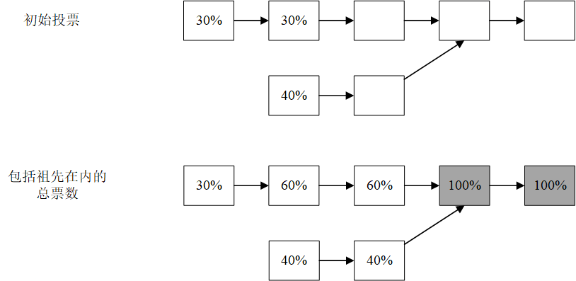

### 4.3.2 GRANDPA  
&emsp;&emsp;如上所述，我们希望有一个灵活的、与区块生产分离的最终确定机制，这一点由GRANDPA实现。为了与GRANDPA一起工作，对BABE的唯一修改是改变分叉选择规则：验证人生成的区块不是建立在最长的链上，而是建立在被敲定的最终完成的最长的链上。GRANDPA可以与许多不同的区块生成机制一起工作，并且有可能用另一种机制来取代BABE。  
&emsp;&emsp;直观地说，GRANDPA是一个拜占庭协议，其功能是从许多可能的分叉中就一条链达成协议。该功能主要通过以下两方面实现：一，遵循部分更为简单的分叉选择规则，二，即便GRANDPA本身停止最终区块敲定区块，其区块生成机制也能够根据概率决定最终区块。我们希望能够同时就许多新生成的区块达成共识，这与单区块拜占庭协议有所不同。  
&emsp;&emsp;我们假设，我们可以向分叉选择规则询问给定的最佳区块。基本的想法是，我们想在大家都同意的链的前缀上达成拜占庭共识。为了使其更加具备健壮性，我们试图就2/3的验证人同意的链的前缀达成一致。  
  

图4：GRANDPA票数及其汇总方式
  
&emsp;&emsp;我们在投票规则上使用了贪婪最重可观测子树（GHOST）算法，很像Casper TFG或一些建议用于Casper FFG的分叉选择规则。我们的内部结构上像一个更传统的拜占庭协议形式来使用这个规则处理投票。如图4所示，GHOST规则工作原理如下：我们设置一组由区块哈希给出的投票，诚实的验证人有且只有一票，并去由以下方式归纳形成的链头。我们从创世区块开始，然后包括该区块中2/3的投票者投票给其后生成的区块，只要正好有一个这样的即可。这个区块头包含g(V)，其中V是投票的集合。如图4所示，左边是单个区块的票数，右边是每个区块及其所有后代的总票数。创世区块位于顶部，我们从它的子块中选出得票率为100%（>2/3）的票数。该区块的子代分别拥有60%和40%的票数。因为这些票数低于2/3，所以我们停止并返回第二个区块。  

&emsp;&emsp;一轮GRANDPA共识有两个投票阶段：预投票和预提交。首先，验证人对最佳链进行预投票；然后，他们根据2/3-GHOST规则，g，应用于他们所看到的预选票集V并对g(V)进行预提交；最后，他们对看到的预提交集合C和最终确定g(C)。  

&emsp;&emsp;为了确保安全，我们确保所有的投票都是有可能在上一轮被敲定的任何区块的后代。节点保持着对上一轮可能已经完成的区块的估计值，该估计值是根据预投票和预提交中计算出来的。在开始新的一轮之前，一个节点会等待，直到它看到足够多的预提交，以确保在不同的链上或后来的同一链上没有区块可以最终完成本轮的区块敲定。然后，它确保在下一轮只对属于上一轮估计的后代区块进行预投票和预提交，它通过监听上一轮的预承诺来持续更新。这就保证了安全性。  
&emsp;&emsp;为了确保有效性，我们轮流选择一个验证人作为主验证人。他们在这一轮开始时广播他们对上一轮的估计。然后，当验证人进行预投票时，如果主块通过了两项检查，即它至少是验证人的评估结果，并且在上一轮中它和它的后代得到超过了2/3的预投票，那么它就会对包括主块在内的最佳链进行预投票。这里的想法是，如果主块没有被最终敲定，那么通过最终敲定区块来取得进展。如果主要的区块没有被最终确定，并且所有验证人都同意包括最后一个最终确定的区块在内的最佳链，我们最终应该这样做，因为BABE自己给出了概率上的最终确定，那么我们现在通过最终确定该链取得进展。  
